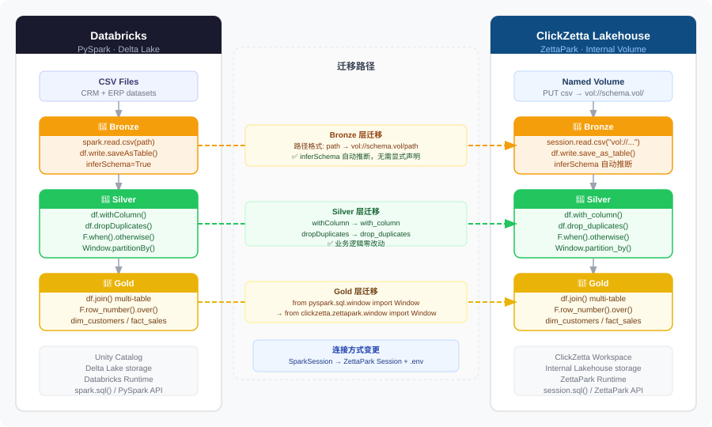
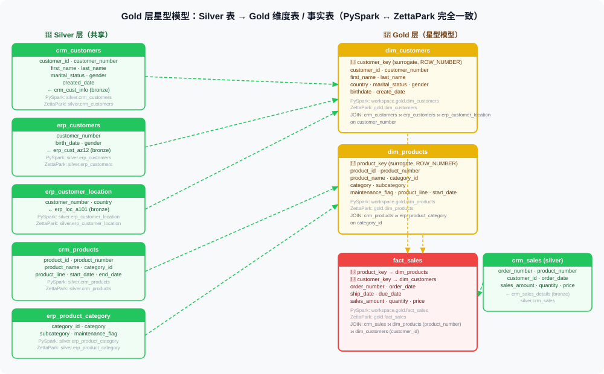

# spark2lakehouse-medallion

> **Spark SQL → ClickZetta Lakehouse 迁移示例**

本项目 fork 自 [DataWithBaraa/databricks_bootcamp_2026](https://github.com/DataWithBaraa/databricks_bootcamp_2026)（MIT License），在保留原始 Databricks Notebook 代码的基础上，新增了对应的 **ClickZetta ZettaPark Python 实现**和**迁移说明文档**。

## 架构对比与迁移路径



## 迁移兼容性结论

原始代码使用 PySpark DataFrame API，迁移目标是 **ZettaPark**（ClickZetta 的 Python DataFrame 框架）。

| PySpark 用法 | ZettaPark 等价写法 | 兼容性 |
|-------------|------------------|--------|
| `spark.read.csv(path)` | `session.read.csv("vol://schema.vol/path")` | ✅ 直接替换，路径格式不同 |
| `df.withColumn(name, expr)` | `df.with_column(name, expr)` | ✅ 仅命名风格差异（下划线） |
| `df.withColumnRenamed(old, new)` | `df.with_column_renamed(old, new)` | ✅ 同上 |
| `F.when().otherwise()` | `F.when().otherwise()` | ✅ 完全一致 |
| `F.col() / F.lit() / F.trim()` 等 | 同名函数 | ✅ 完全一致 |
| `df.filter() / select() / join()` | 同名方法 | ✅ 完全一致 |
| `df.write.mode("overwrite").saveAsTable(t)` | `df.write.save_as_table(t, mode="overwrite")` | ✅ 参数位置略有调整 |
| `spark.sql(query)` | `session.sql(query)`（本项目未使用，全程 DataFrame API） | ✅ 完全一致 |
| `F.row_number().over(window)` | `F.row_number().over(Window.order_by(...))` | ✅ 完全一致，导入路径略有不同 |
| `from pyspark.sql.window import Window` | `from clickzetta.zettapark.window import Window` | ✅ 模块路径不同，用法完全一致 |
| `schema.inferSchema = True` | `session.read.option("header","true").csv(path)` | ✅ 支持自动推断，无需显式声明 |

**结论：本项目涉及的 PySpark DataFrame API 全部可迁移到 ZettaPark，无需改写任何业务逻辑，全程使用 DataFrame API（无 SQL 回退）。两侧代码结构完全对称，差异仅限于：连接方式（SparkSession → ZettaPark Session）、CSV 路径格式（本地/DBFS → `vol://`）、Window 模块导入路径，以及方法命名风格（camelCase → snake_case）。**

## 项目结构

```
├── 00_resource/        # 🖼️  架构图、数据模型映射 SVG
│
├── 01_spark/           # 📦 原始 Databricks Notebooks（PySpark，只读参考）
│   ├── 01_bronze/      #   Bronze 层：spark.read.csv() → Delta 写入
│   ├── 02_silver/      #   Silver 层：DataFrame filter/withColumn/dropDuplicates
│   └── 03_gold/        #   Gold 层：DataFrame join + 聚合
│
├── 02_migration/       # 📖 迁移说明文档
│   ├── 01_overview.md          迁移策略与关键差异
│   └── 02_medallion_mapping.md 逐层语法对照
│
├── 03_lakehouse/       # ✅ 迁移后的 ClickZetta ZettaPark Notebooks（与 01_spark 一一对应）
│   ├── init_lakehouse.ipynb    创建 Schema、Volume，上传 CSV 数据集
│   ├── 01_bronze/              bronze.ipynb：从 Volume 读取 CSV → 写入 bronze 表
│   ├── 02_silver/              crm/ + erp/ 各 3 个 notebook + orchestration
│   │   ├── crm/                silver_crm_cust_info / prd_info / sales_details
│   │   └── erp/                silver_erp_cust_az12 / loc_a101 / px_cat_g1v2
│   └── 03_gold/                gold_dim_customers / dim_products / fact_sales / orchestration
│
├── datasets/           # 原始数据集（CRM + ERP CSV 文件）
├── 04_validate.ipynb      # ✔️  迁移验证（22 项数据质量检查）
└── .env.sample         # 连接配置模板
```

## 数据架构

| 层次 | 说明 | 原始实现 | Lakehouse 实现 |
|------|------|---------|---------------|
| Bronze | 原始数据，不做转换 | PySpark 读 CSV → 写 Delta | ZettaPark `session.read.csv()` → `save_as_table()` |
| Silver | 清洗、去重、标准化 | PySpark DataFrame 转换 | ZettaPark `with_column()` + `F.when()` |
| Gold | 维度建模（dim/fact） | PySpark join + 聚合 | ZettaPark `df.join()` + `F.row_number()` |

### Gold 层数据模型映射



## 数据源

- **CRM 系统**：客户信息（cust_info）、产品信息（prd_info）、销售明细（sales_details）
- **ERP 系统**：客户补充信息（CUST_AZ12）、地区信息（LOC_A101）、产品分类（PX_CAT_G1V2）

## 快速开始

```bash
# 1. 安装依赖
pip install clickzetta_zettapark_python python-dotenv jupyter

# 2. 配置连接
cp .env.sample .env
# 编辑 .env，填写 ClickZetta 连接信息

# 3. 初始化（创建 Schema、Volume，上传 CSV 数据集）
python setup.py

# 4. 按顺序运行 notebooks
jupyter notebook
# 依次运行：
#   03_lakehouse/01_bronze/bronze.ipynb
#   03_lakehouse/02_silver/silver_orchestration.ipynb
#   03_lakehouse/03_gold/gold_orchestration.ipynb

# 5. 验证迁移结果
#   运行 04_validate.ipynb

# 6. 清理所有 Lakehouse 对象（测试完成后）
python reset.py
```

阅读 [迁移概述](02_migration/01_overview.md) 和 [Medallion 架构映射](02_migration/02_medallion_mapping.md) 了解迁移细节。

## 迁移验证

`04_validate.ipynb` 对迁移结果执行 22 项自动化检查：

| 检查类别 | 内容 |
|---------|------|
| 行数合理性 | 各层表有数据，行数符合预期 |
| Bronze → Silver 一致性 | Silver 不丢行，销售明细完整 |
| 关键列无空值 | 主键、外键均不为 NULL |
| 数据清洗效果 | gender / marital_status / country 标准化正确 |
| 维度完整性 | surrogate key 无重复 |
| 外键完整性 | fact_sales 所有外键均能关联到 dim 表 |
| 业务指标合理性 | 数量 > 0，country 覆盖率 > 50% |

实际运行结果：**20/22 通过，迁移逻辑全部正确**。2 项警告为源数据本身的质量问题（非迁移引入）：
- `crm_cust_info` 原始数据存在 5 组重复 `customer_id`
- `crm_sales_details` 存在 3 条负销售额（退货/冲销单）

## 原始项目

- 原始作者：[DataWithBaraa](https://github.com/DataWithBaraa)
- 原始 Repo：[databricks_bootcamp_2026](https://github.com/DataWithBaraa/databricks_bootcamp_2026)
- License：MIT
- 技术栈：Databricks、PySpark、Delta Lake、Unity Catalog